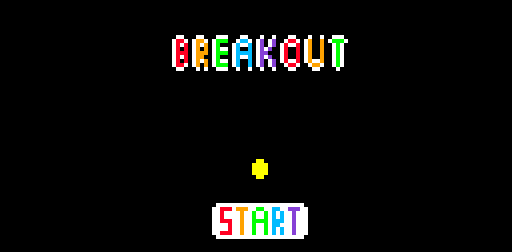
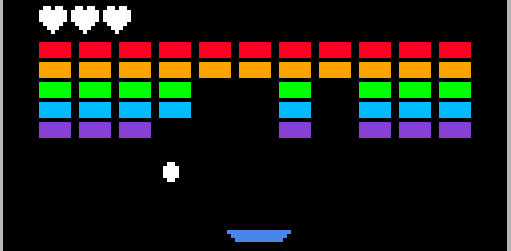
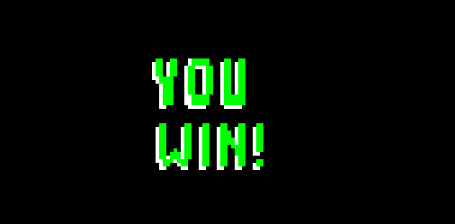
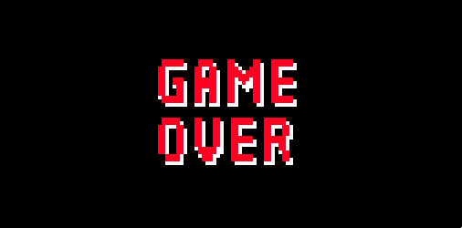

# Projeto-Breakout 🔴🟠🟢🔵🟣
Código oficial do jogo similar ao tradicional jogo Breakout

## Tópicos sobre o projeto 
- A linguagem utilizada foi Assembly;
- Foi feito e testado no simulador Mars Mips;
- É um projeto acadêmico;
- Tem ao total 2894 linhas;
- Foi feito em dupla.

## Como funciona o jogo
Breakout é um jogo antigo e tradicional de atari que possui versões atuais também, basicamente o objetivo dele é fazer com que todos os blocos sejam quebrados, para isso é utilizado uma bola e barra para movimentação.

## Tela Inicial
Clicando na tecla 'b' podemos iniciar o jogo

## Tela Principal
 - O seu objetivo é quebrar todos o blocos para ganhar, se deixar a bola escapar da barra por 3 vezes você perde :( 
 - Quando a bola bate nas extremidades da barra ela sobe na diagonal, assim mudando sua direção
 - Para movimentar a barra utilize a tecla 'a' para esquerda e 'd' para a direita. Boa sorte forasteiro 🫡 
 

## Tela de Game Over e Yin
Após a quebra de todos os blocos você ganha ;)

Após perde todos os corações você perde o jogo :(

